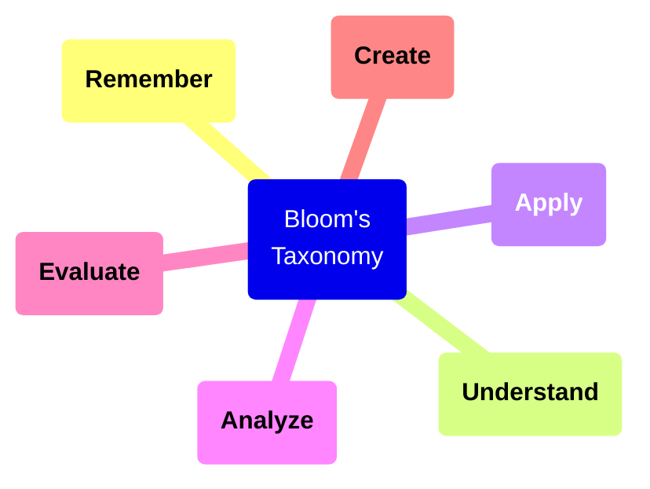
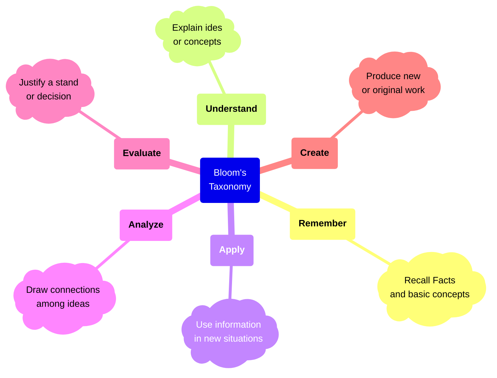
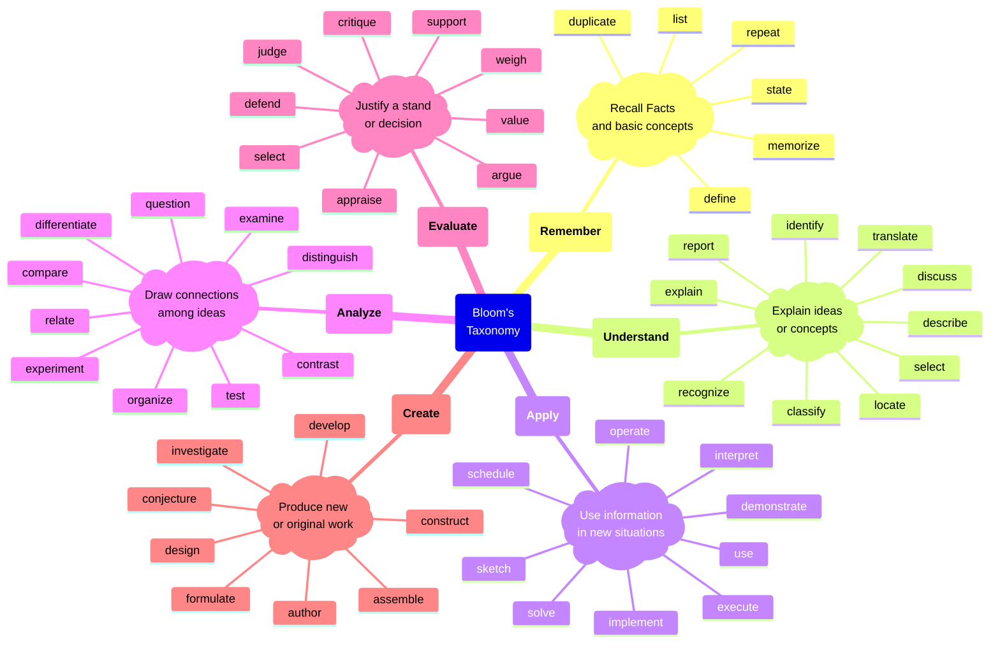
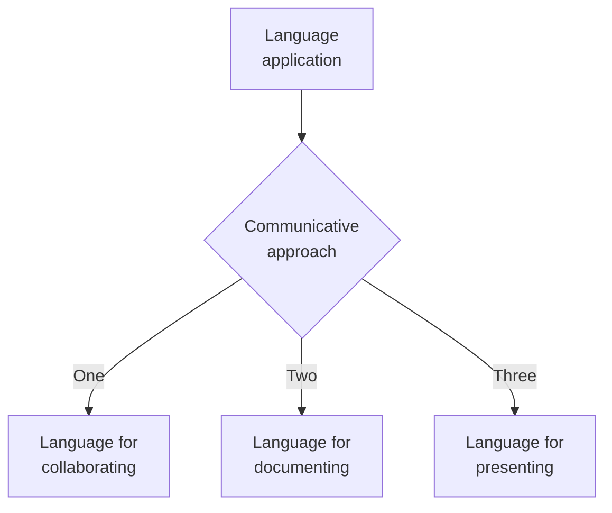
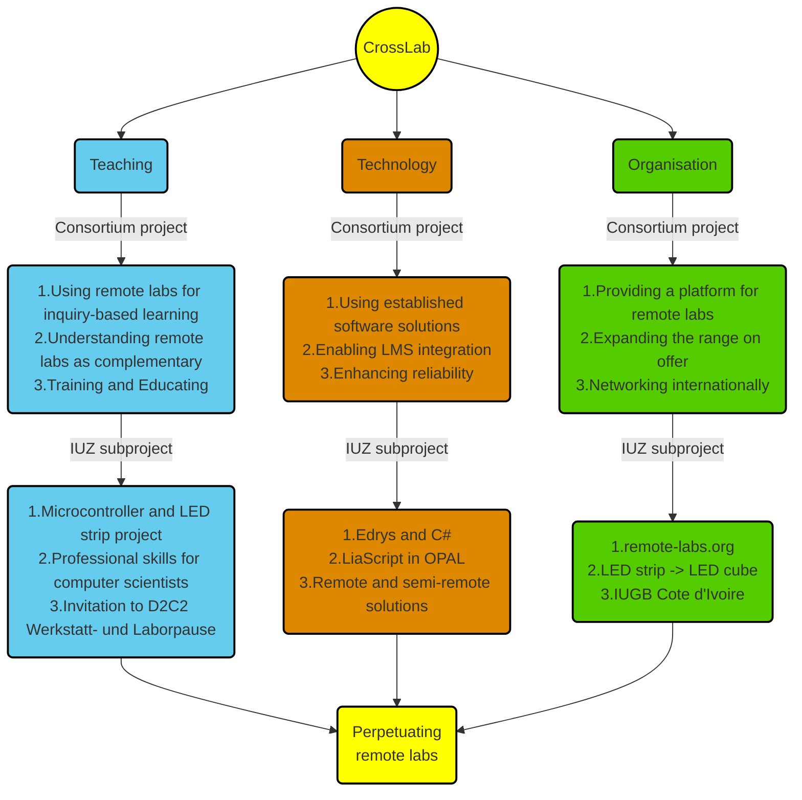

<!--
author:   Mark Jacob
email:    Mark.Jacob@iuz.tu-freiberg.de
version:  0.1.0
language: en
narrator: US English Female

comment:  This simple description of your course.
          Multiline is also okay.

link:     https://cdn.jsdelivr.net/chartist.js/latest/chartist.min.css

script:   https://cdn.jsdelivr.net/chartist.js/latest/chartist.min.js

icon: https://upload.wikimedia.org/wikipedia/commons/2/28/Logo_TU_Freiberg.svg

import: https://raw.githubusercontent.com/liaScript/mermaid_template/master/README.md

-->

# Remote Labs in language courses

    {{1-2}}
??

    {{2-3}}
??

    {{3-4}}
https://tu-dresden.de/zill/das-zentrum/projekte/d2c2/werkstatt-und-laborpause?set_language=de

    {{4}}
!?[alt-text](/images/crosslab_taster.mp4)

## Language teaching approaches

- Communicative approach
- Task-based learning

### The Communicative Approach

**Principles of the communicative approach:**

https://ontesol.com/communicative-approach/

1. Language learning is learning to communicate using the target language.
2. The language used to communicate must be appropriate to the situation, the roles of the speakers, the setting and the register. The learner needs to differentiate between a formal and an informal style.
3. Communicative activities are essential. Activities should be presented in a situation or context and have a communicative purpose. Typical activities of this approach are: games, problem-solving tasks, and role-play. There should be information gap, choice and feedback involved in the activities.
4. Learners must have constant interaction with and exposure to the target language.
5. Development of the four macroskills — speaking, listening, reading and writing — is integrated from the beginning, since communication integrates the different skills.
6. The topics are selected and graded regarding age, needs, level, and students’ interest.
7. Motivation is central. Teachers should raise students’ interest from the beginning of the lesson.
8. The role of the teacher is that of a guide, a facilitator or an instructor.
9. Trial and error is considered part of the learning process.
10. Evaluation concerns not only the learners’ accuracy but also their fluency.

### Task-based learning and teaching

**Task-Based Learning: what it is?**

https://www.teacheracademy.eu/blog/task-based-learning/

Task-Based Learning (TBL) is all about your students creating, producing, or designing something in class… it could be anything… anything at all. TBL includes the 21st Century skills of Communication, Collaboration, Creativity, and Critical Thinking (4C’s) and can also be described as a short interactive assignment that results in a finished product.

The Task part of Task-Based Learning has been (more or less) defined by linguistic scholars as:

- things people do in everyday life (Long, 1985).
- a goal-oriented activity that leads to an outcome or result (Willis, 1996).
- a completed work plan which can be assessed (Ellis, 2003).

**What kind of activity is a task?**

In 2007, Jane Willis and her husband Dave Willis came up with the following criteria in their book Doing Task-Based Teaching (pp. 12-14) which can be used to discern a task:

Will the activity engage learners’ interest?

- Is there a primary focus on meaning?
- Is there a goal or an outcome?
- Is success judged in terms of the result?
- Is completion a priority?
- Does the activity relate to real-world activities?

If your answer is yes to all the questions, you can be sure that the classroom activity you have in mind is task-like.

## General teaching approaches

- Project-based learning
- Inquiry-based learning

## Bloom's taxonomy

    {{0-1}}

    {{1-2}}

    {{2-3}}

    {{3}}
- Create
- Evaluate
- Analyze
- Apply
- Understand
- Remember

## Constructive alignment

### Intended Learning Outcomes

#### Lab ILOs

??

#### Language ILOs

#### Communication ILOs

#### Digital literacy ILOs

#### Personal Development ILOs

- Leadership
- Teamwork
- Overcoming difficulties

#### Subject ILOs

## Project phases

Project management theory of a project

- Planning
- Defining goals
- Following instructions
- Understanding Tasks

Teamwork theory

## Types of tasks

Real etc (see Ellis)

Linking the tasks to Bloom's taxonomy to ILOs to project phases to teaching approaches to support

## Support

### Linguistic

### Technical

### Subject

### Communication

## Mindset

## How do we integrate CrossLab and Language courses?

