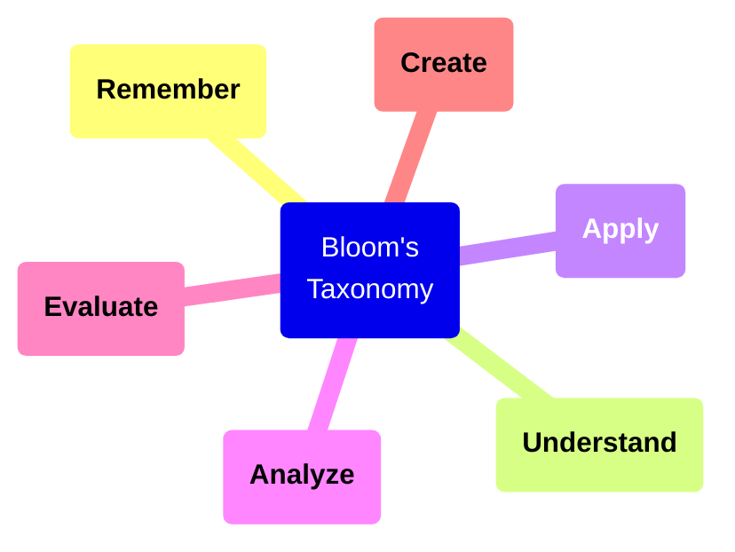
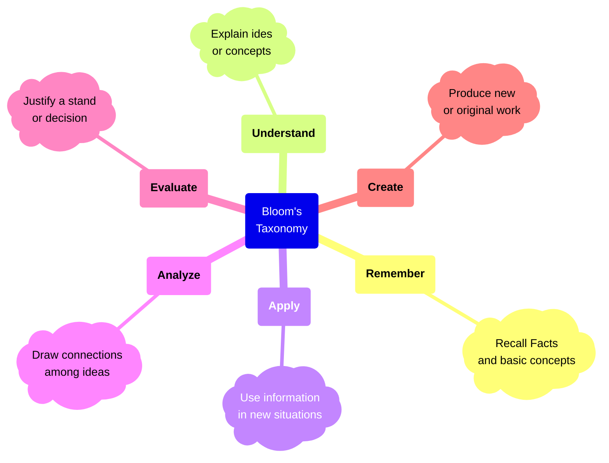
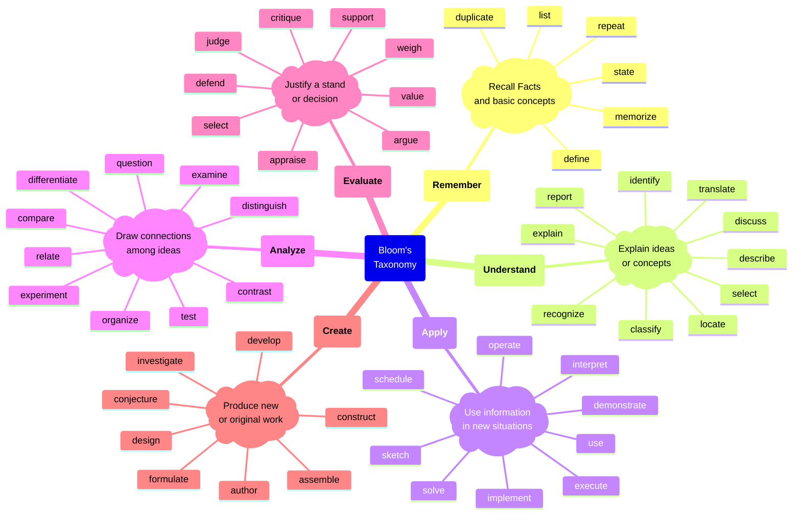

<!--
author:   Mark Jacob
email:    Mark.Jacob@iuz.tu-freiberg.de
version:  0.1.0
language: en
narrator: US English Female

comment:  This simple description of your course.
          Multiline is also okay.

link:     https://cdn.jsdelivr.net/chartist.js/latest/chartist.min.css

script:   https://cdn.jsdelivr.net/chartist.js/latest/chartist.min.js

icon: https://upload.wikimedia.org/wikipedia/commons/2/28/Logo_TU_Freiberg.svg

import: https://raw.githubusercontent.com/liaScript/mermaid_template/master/README.md

-->

# Remote Labs in language courses

Overview

## Language teaching approaches

- Communicative approach
- Task-based learning

## General teaching approaches

- Project-based learning
- Inquiry-based learning

## Bloom's taxonomy

    {{0-1}}

    {{1-2}}

    {{2-3}}

    {{3}}
- Create
- Evaluate
- Analyze
- Apply
- Understand
- Remember

## Constructive alignment

### Intended Learning Outcomes

#### Lab ILOs

??

#### Language ILOs

#### Communication ILOs

#### Digital literacy ILOs

#### Personal Development ILOs

- Leadership
- Teamwork
- Overcoming difficulties

#### Subject ILOs

## Project phases

Project management theory of a project

- Planning
- Defining goals
- Following instructions
- Understanding Tasks

Teamwork theory

## Types of tasks

Real etc (see Ellis)

Linking the tasks to Bloom's taxonomy to ILOs to project phases to teaching approaches to support

## Support

### Linguistic

### Technical

### Subject

### Communication

## Mindset

